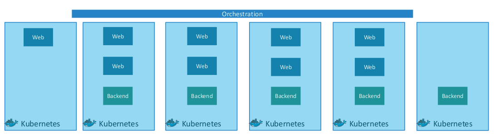

# CKA requirements
강의를 기반으로 CKA 기본을 다진 내용을 정리한다.

Kubernetes는 Container+Orchestration의 집합이다.



일단 **Node**( 과거에는 Minion이라고 함 )가 있다. 물리적 또는 가성 머신이다. 클러스터는 Node 여러 개로 구성된 집합이다. 

Node에는 **Master** 와 **Worker**가 있다. Master에는 **kube-api server**가 있어 Worker의 **kubelet**과 통신하며 관리할 수 있다. **ETCD**라는 key-value 저장소는 Node에 대한 정보를 저장하고 관리하는데 사용한다. **Scheduler**를 통해 Node에 워크와 컨테이너를 분산시킨다. 

Worker Node에는 컨테이너를 실행시킬 수 있는 도커와 같은 **런타임** 환경이 있다. 


**Minikube**는 위의 모든 것을 통합하여 로컬 시스템에서 실행시킬 수 있다. 대신 minikube는 단일 Worker Node 쿠버네티스 클러스터만 세팅하는 경우에 이용한다. kubernetes CLI인 kubectl을 함께 설치하여 쿠버네티스를 활용한다. 여러 node cluster를 구성하는 경우 **kubeadm**을 사용해야 한다. 

**Pod**는 쿠버네티스 내에서 가장 작은 단위로 실행시켜야 할 컨테이너들을 하나의 application으로 묶은 인스턴스이다. 보통 하나의 docker container를 하나의 Pod에서 실행시킨다. 사용자가 늘어남에 따라 더 많은 트래픽을 감당하기 위해서는 Node내에서 Pod를 늘리거나 Node 자체를 늘려 서비스를 확장할 수 있다.

주로 Pod는 YAML 파일로 작성하여 생성한다.

## <i>Application LifeCycle Management</i>

### Rolling Updates and Rollbacks
deployment 전략은 2가지 있다: **Recreate**는 한번에 업데이트하는 방식이고 **RollingUpdate**(default)는 하나씩 업데이트하는 방식이다.

deployment yaml 파일을 수정해서 `apply`하면 업데이트된다. 
아래처럼 old replicaset에서 new replicaset으로 생성되는 것을 알 수 있다.
```
controlplane ~ ➜  kubectl get replicaset
NAME                  DESIRED   CURRENT   READY   AGE
frontend-5c74c57d95   3         3         3       3m46s
frontend-d495f944b    2         2         2       23s

controlplane ~ ➜  kubectl get replicaset
NAME                  DESIRED   CURRENT   READY   AGE
frontend-5c74c57d95   1         1         1       3m49s
frontend-d495f944b    4         4         2       26s

controlplane ~ ➜  kubectl get replicaset
NAME                  DESIRED   CURRENT   READY   AGE
frontend-d495f944b    4         4         4       2m19s
frontend-5c74c57d95   0         0         0       5m42s

```

kubectl rollout을 취소하려면 **rollback** 해줘야 한다. 

### Commands and Args
docker에서 실제로 실행되는 프로세스는 `CMD`로 명시해준다. ex: `CMD ["sleep", "5"]`와 같이 실행 가능한 프로그램을 argument와 따로 명시한다.( `CMD ["sleep 5"] `X )   
`ENTRYPOINT`는 프로그램 시작시 실행한 command를 설정한다. 

쿠버네티스에서 `ENTRYPOINT`-> `command`, `CMD`-> `args`로 override된다.

### Environment Variables
`env` 로 환경 변수를 하드코딩할 수 있으나 configmap을 활용하는 방법도 있다.
1. ConfigMap을 생성하고
2. Pod에 inject한다.

- imperative : `--from-literal=`으로 command line에서 설정
- declarative : configmap.yaml에서 설정
    ```
    envFrom:
     - configMapRef:
        name: app-config
    ```