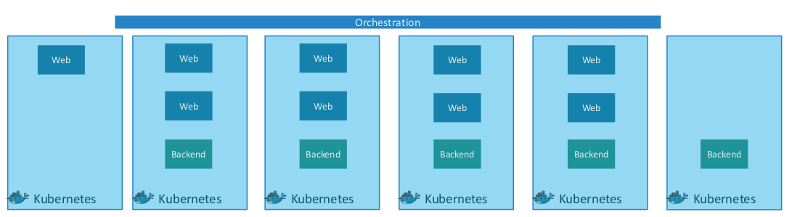

# CKA base

Kubernetes는 Container+Orchestration의 집합이다.

일단 **Node**( 과거에는 Minion이라고 함 )가 있다. 물리적 또는 가성 머신이다. 클러스터는 Node 여러 개로 구성된 집합이다. 

Node에는 **Master** 와 **Worker**가 있다. Master에는 **kube-api server**가 있어 Worker의 **kubelet**과 통신하며 관리할 수 있다. **ETCD**라는 key-value 저장소는 Node에 대한 정보를 저장하고 관리하는데 사용한다. **Scheduler**를 통해 Node에 워크와 컨테이너를 분산시킨다. 

Worker Node에는 컨테이너를 실행시킬 수 있는 도커와 같은 **런타임** 환경이 있다. 

**Minikube**는 위의 모든 것을 통합하여 로컬 시스템에서 실행시킬 수 있다. 대신 minikube는 단일 Worker Node 쿠버네티스 클러스터만 세팅하는 경우에 이용한다. kubernetes CLI인 kubectl을 함께 설치하여 쿠버네티스를 활용한다. 여러 node cluster를 구성하는 경우 **kubeadm**을 사용해야 한다. 

**Pod**는 쿠버네티스 내에서 가장 작은 단위로 실행시켜야 할 컨테이너들을 하나의 application으로 묶은 인스턴스이다. 보통 하나의 docker container를 하나의 Pod에서 실행시킨다. 사용자가 늘어남에 따라 더 많은 트래픽을 감당하기 위해서는 Node내에서 Pod를 늘리거나 Node 자체를 늘려 서비스를 확장할 수 있다.

주로 Pod는 YAML 파일로 작성하여 생성한다.