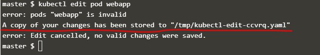

## Tips
### Imperative Commands with Kubectl

`--dry-run` : `--dry-run=client`를 설정하면 해당 resource를 생성하지 않는 대신 필요한 조건을 추출한다.

`-o yaml`: resource definition을 yaml파일로 출력한다. 

**Create an NGINX Pod**
```console
$ kubectl run nginx --image=nginx
```
**Generate POD Manifest YAML file (-o yaml)**
Don't create it(--dry-run)
```console
$ kubectl run nginx --image=nginx --dry-run=client -o yaml
```
**Create a deployment**
```console
$ kubectl create deployment --image=nginx nginx
```
**Generate Deployment YAML file (-o yaml)**
Don't create it(--dry-run)
```console
$ kubectl create deployment --image=nginx nginx --dry-run=client -o yaml
```
**Generate Deployment with 4 Replicas**
```console
$ kubectl create deployment nginx --image=nginx --replicas=4
```
You can also scale a deployment using the kubectl scale command.
```console
$ kubectl scale deployment nginx --replicas=4
```
Another way to do this is to save the YAML definition to a file and modify
```console
$ kubectl create deployment nginx --image=nginx --dry-run=client -o yaml > nginx-deployment.yaml
```
**Create a Service named redis-service of type <i>ClusterIP</i> to expose pod redis on port 6379**
- automatically use the pod's labels as selectors
```console
$ kubectl expose pod redis --port=6379 --name redis-service --dry-run=client -o yaml
```
- not use the pods labels as selectors, instead assume selectors as app=redis. : You have to generate the file and modify the selectors before creating the service)
```console
$ kubectl create service clusterip redis --tcp=6379:6379 --dry-run=client -o yaml 
```
**Create a Service named nginx of type <i>NodePort</i> to expose pod nginx's port 80 on port 30080 on the nodes**
- automatically use the pod's labels as selectors, but cannot specify the node port : You have to generate a definition file and then add the node port in manually before creating the service with the pod
```console
$ kubectl expose pod nginx --type=NodePort --port=80 --name=nginx-service --dry-run=client -o yaml
```
- not use the pods labels as selectors
```console
$ kubectl create service nodeport nginx --tcp=80:80 --node-port=30080 --dry-run=client -o yaml
```

### CANNOT edit specifications of an existing POD
- spec.containers[*].image
- spec.initContainers[*].image
- spec.activeDeadlineSeconds
- spec.tolerations

이미 존재하는 Pod에 대해 `kubectl edit`로 수정이 불가한 부분을 변경해서 적용하려면 아래와 같은 메시지가 뜬다.  


저장하면 임시 파일이 생성된다.  


1. 기존의 Pod를 삭제하고, 임시 저장된 definition 파일로 `kubectl create -f /tmp/kubectl-edit-ccvrq.yaml`로 새로 생성한다.
2. `kubectl get pod webapp -o yaml > my-new-pod.yaml`로 기존의 pod의 definition yaml파일을 생성한다. 파일을 수정하면 기존 Pod를 삭제하고 새로 수정한 yaml파일로 생성한다.

