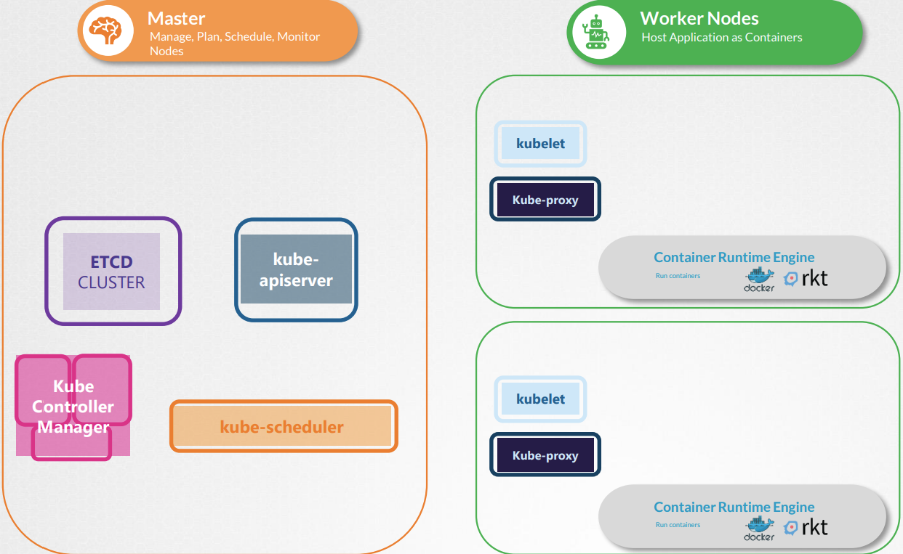

# Kubernetes 
[Udemy CKA 강의](https://www.udemy.com/course/certified-kubernetes-administrator-with-practice-tests) 를 듣고 정리한 공간. 

## Core Concept


### ETCD
분산된 reliable key-value store이다.

**[설치 및 실행]**
```console
$ curl -L https://github.com/etcd-io/etcd/releases/download/v3.3.11/etcdv3.3.11-linux-amd64.tar.gz -o etcd-v3.3.11-linux-amd64.tar.gz
$ tar xzvf etcd-v3.3.11-linux-amd64.tar.gz
$ ./etcd
```

#### key - value를 저장
```console
$ ./etcd set key_1 value_1
```
#### key값 가져오기
```console
$ ./etcd get key_1
```
**[kubeadm]** 에서 확인할 수 있다.
```console
$ kubectl get pods -n kube-system
---------------------------------
NAMESPACE NAME READY STATUS RESTARTS AGE
...
kube-system etcd-master 1/1 Running 0 1h
```
etcd master POD의 key들을 확인할 수 있다. registry안에 pods, replicasets, roles 등에 정보가 있다.
```console
$ kubectl exec etcd-master –n kube-system etcdctl get / --prefix –keys-only
---------------------------------
/registry/apiregistration.k8s.io/apiservices/v1.
/registry/apiregistration.k8s.io/apiservices/v1.apps
/registry/apiregistration.k8s.io/apiservices/v1.authentication.k8s.io
/registry/apiregistration.k8s.io/apiservices/v1.authorization.k8s.io
/registry/apiregistration.k8s.io/apiservices/v1.autoscaling
/registry/apiregistration.k8s.io/apiservices/v1.batch
/registry/apiregistration.k8s.io/apiservices/v1.networking.k8s.io
/registry/apiregistration.k8s.io/apiservices/v1.rbac.authorization.k8s.io
/registry/apiregistration.k8s.io/apiservices/v1.storage.k8s.io
/registry/apiregistration.k8s.io/apiservices/v1beta1.admissionregistration.k8s.io
```

### Kube-API Server
유일하게 ETCD와 직접 소통하여 사용자를 인증하고, 요청을 허가하여 데이터를 불러온다.

```console
$ kubectl get nodes
---------------------------------
NAME STATUS ROLES AGE VERSION
master Ready master 20m v1.11.3
node01 Ready <none> 20m v1.11.3
```
**[설치]**
```console
$ wget https://storage.googleapis.com/kubernetes-release/release/v1.13.0/bin/linux/amd64/kube-apiserver
```
**[kubeadm]** 에서 확인할 수 있다.

```console
$ kubectl get pods -n kube-system
---------------------------------
NAMESPACE NAME READY STATUS RESTARTS AGE
...
kube-system kube-apiserver-master 1/1 Running 0 15m
```

### Kube Controller Manager
쿠버네티스에서 지속적으로 모니터링한다.
**[설치]**
```console
$ wget https://storage.googleapis.com/kubernetes-release/release/v1.13.0/bin/linux/amd64/kube-controller-manager
```
**[kubeadm]** 에서 확인할 수 있다.

```console
$ kubectl get pods -n kube-system
---------------------------------
NAMESPACE NAME READY STATUS RESTARTS AGE
...
kube-system kube-controller-manager-master 1/1 Running 0 15m
```

### Kube Scheduler
pod를 지정하기 위해 가장 적절한 node를 선정한다.
**[설치]**
```console
$ wget https://storage.googleapis.com/kubernetes-release/release/v1.13.0/bin/linux/amd64/kube-scheduler
```
**[kubeadm]** 에서 확인할 수 있다.


### Kubelet
worker node를 등록하거나 master Scheduler에 의해 POD를 생성하여 docker image를 빌드하거나 POD의 상태를 모니터링하여 Kube-API에 보고한다.

Kubeadm에 의해 설치되지 않기에 worker node에 직접 설치해야 한다.
**[설치]**
```console
$ wget https://storage.googleapis.com/kubernetes-release/release/v1.13.0/bin/linux/amd64/kubelet
```

### Kube Proxy
IP table rules을 이용하여 POD 네트워크를 연결해 클러스터 내에서 서로 통신할 수 있도록 한다.
**[설치]**
```console
$ wget https://storage.googleapis.com/kubernetes-release/release/v1.13.0/bin/linux/amd64/kube-proxy
```
**[kubeadm]** 에서 확인할 수 있다.

```console
$ kubectl get pods -n kube-system
---------------------------------
NAMESPACE NAME READY STATUS RESTARTS AGE
...
kube-system kube-proxy-lzt6f 1/1 Running 0 16m
kube-system kube-proxy-zm5qd 1/1 Running 0 16m
```
### PODs

#### nginx 이미지를 pod를 생성
```console
$ kubectl run nginx --image nginx
```

#### 현재 실행중인 Pod 파악
```console
$ kubectl get nodes
```


#### YAML
```yaml
apiVersion: v1
kind: Pod
metadata:
  name: nginx
  labels:
    app: nginx
    tier: frontend
spec:
  containers:
  - name: nginx
    image: nginx 
  # 여러 컨테이너를 입력할 수 있다.
  # - name: busybox
  #   image: busybox
```

### ReplicaSets
#### Replication Controller
replication controller는 정해진 pod를 유지하거나 로드 밸런싱을 위해 scale up햔다.
```yaml
apiVersion: v1
kind: ReplicationContoller
metadata:
  name: myapp-rc
  labels:
    app: myapp
    tier: front-end
spec:
  template:
    metadata:
      name: myapp-pod
      labels:
        app: myapp
        tier: front-end
    spec:
      containers:
      - name: nginx-container
        image: nginx 
  replicas: 3
```
#### ReplicaSets
replication controller와 차이점은 selector가 포함된다.
```yaml
apiVersion: v1
kind: ReplicaSet
metadata:
  name: myapp-replicaset
...
  replicas: 3
  selector:
    matchLabels:
      type: front-end
```

#### Commands 
replicaset을 생성, 삭제 및 업데이트

```console
$ kubectl create -f replicaset-definition.yml
$ kubectl get replicaset # 1개의 replicaset가 생성되었고, 4개의 Pod가 필요함
------------------------
NAME              DESIRED   CURRENT   READY   AGE
new-replica-set   4         4         0       9s

$ kubectl delete replicaset myapp-replicaset
$ kubectl replace -f replicaset-definition.yml
```

```
controlplane ~ ➜  kubectl explain replicaset
KIND:     ReplicaSet
VERSION:  apps/v1

DESCRIPTION:
     ReplicaSet ensures that a specified number of pod replicas are running at
     any given time.

FIELDS:
   apiVersion   <string>
     APIVersion defines the versioned schema of this representation of an
     object. Servers should convert recognized schemas to the latest internal
     value, and may reject unrecognized values. More info:
     https://git.k8s.io/community/contributors/devel/sig-architecture/api-conventions.md#resources
```
#1. version 이 맞지않는다는 이슈
```yaml
apiVersion: v1 -> apps/v1
kind: ReplicaSet
metadata:
  name: replicaset-1
spec:
  replicas: 2
  selector:
    matchLabels:
      tier: frontend
  template:
    metadata:
      labels:
        tier: frontend
    spec:
      containers:
      - name: nginx
        image: nginx
```
#2. The ReplicaSet "replicaset-2" is invalid: spec.template.metadata.labels: Invalid value: map[string]string{"tier":"nginx"}: `selector` does not match template `labels`
```yaml
apiVersion: v1 -> apps/v1
kind: ReplicaSet
metadata:
  name: replicaset-1
spec:
  replicas: 2
  selector:
    matchLabels:
      tier: frontend
  template:
    metadata:
      labels:
        tier: nginx -> frontend
    spec:
      containers:
      - name: nginx
        image: nginx
```

## Deployment
- rolling updates: 인스턴스를 하나씩 돌면서 업그레이드(한번에 하면 사용에 영향이 있을 수 있음)
- 변화 적용
```yaml
apiVersion: v1 -> apps/v1
kind: Deployment
metadata:
  name: myapp-deployment
...
```

## Namespace
```console
$ kubectl get pods --nampspace=dev
```

```yaml
apiVersion: v1 -> apps/v1
kind: ReplicaSet
metadata:
  name: replicaset-1
  namespace=dev
```
## Services
