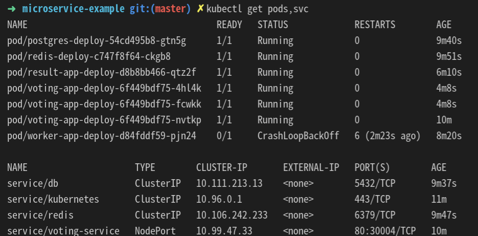
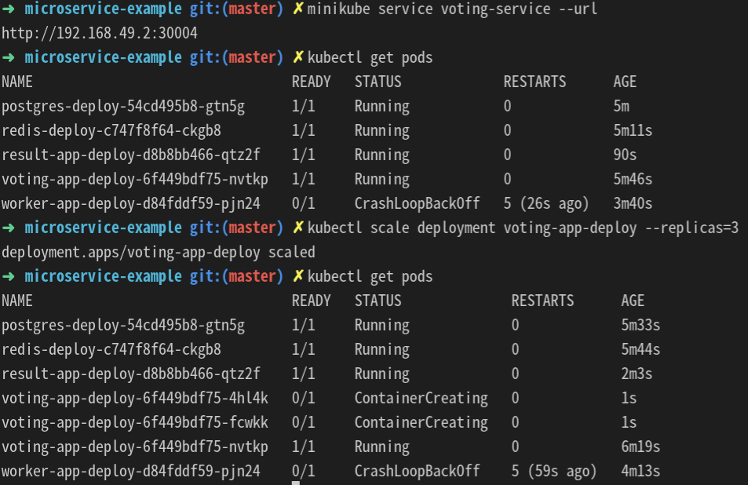

## microservice - voting 
- redis, postgres, result APP, voting APP, worker APP 각 서비스에 대해 Yaml파일로 Pod, Service를 생성한다. 
- 클러스터 내부 통신을 위해 ClusterIP를 설정하고 외부에서 접속하기 위해 NodePort를 지정한다.

- Deployment를 활용하면 하나 이상의 Pod 생성이 가능하여 각각의 pod에 replicaset을 설정하여 scaling한다.

